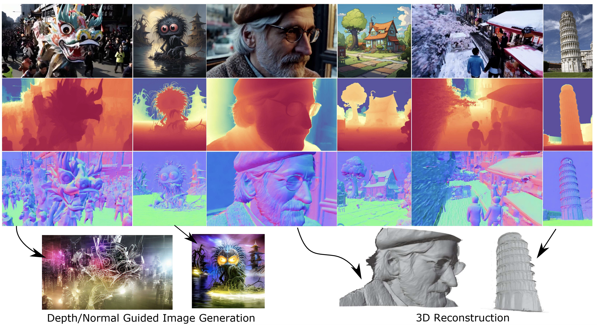

# GeoWizard: Unleashing the Diffusion Priors for 3D Geometry Estimation from a Single Image (ECCV 2024)
### [Project Page](https://fuxiao0719.github.io/projects/geowizard/) | [Paper](https://arxiv.org/abs/2403.12013) | [Hugging Face](https://huggingface.co/spaces/lemonaddie/geowizard)
<br/>

> GeoWizard: Unleashing the Diffusion Priors for 3D Geometry Estimation from a Single Image
                                                                 
> [Xiao Fu*](http://fuxiao0719.github.io/), [Wei Yin*](https://yvanyin.net/), [Mu Hu*](https://github.com/JUGGHM), [Kaixuan Wang](https://wang-kx.github.io/), [Yuexin Ma](https://yuexinma.me/), [Ping Tan](https://ece.hkust.edu.hk/pingtan), [Shaojie Shen](https://uav.hkust.edu.hk/group/), [Dahua Lin†](http://dahua.site/) , [Xiaoxiao Long†](https://www.xxlong.site/)
> * Equal contribution; † Corresponding authors                    
> ECCV, 2024



## 🛠️ Setup

We test our codes under the following environment: `Ubuntu 22.04, Python 3.9.18, CUDA 11.8`.
1. Clone this repository.
```bash
git clone git@github.com:fuxiao0719/GeoWizard.git
cd GeoWizard
```
2. Install packages
```bash
conda create -n geowizard python=3.9
conda activate geowizard
pip install -r requirements.txt
cd geowizard
```

## 🤖 Usage

### Run inference for depth & normal

Place your images in a directory `input/example` (for example, where we have prepared several cases), and run the following inference. The depth and normal outputs will be stored in `output/example`.

```bash
python run_infer.py \
    --input_dir ${input path} \
    --output_dir ${output path} \
    --ensemble_size ${ensemble size} \
    --denoise_steps ${denoising steps} \
    --seed ${seed} \
    --domain ${data type}
# e.g.
python run_infer.py \
    --input_dir input/example \
    --output_dir output \
    --ensemble_size 5 \
    --denoise_steps 10 \
    --seed 0 \
    --domain "indoor"
```

Inference settings: `--domain`: Data type. Options: "indoor", "outdoor", and "object". Note that "object" is best for background-free objects, like that in objaverse. We find that "indoor" will suit in most scenarios. Default: "indoor". `--ensemble_size` and `--denoise_steps`: trade-off arguments for speed and performance, more ensembles and denoising steps to get higher accuracy. Default: 5 and 10 (For academic comparison, please set 10 and 50, respectively). 

### Run inference for depth & normal (object-oriented)

(2024-04-13) To further meet the community feedback on our v1-model for object-level applications, we additionally train a v2-model on Objaverse with some architecture modifications. Now it can generate more realistic and three-dimensional normal maps on some rare images (e.g., cartoon style, see below). Hope that it could provide more help to the community, and the advanced models will continue to come if further needed.

```bash
python run_infer_object.py \
    --input_dir ${input path} \
    --output_dir ${output path} \
    --ensemble_size ${ensemble size} \
    --denoise_steps ${denoising steps} \
    --seed ${seed} \
    --domain "object"
# e.g.
python run_infer_object.py \
    --input_dir input/example_object \
    --output_dir output_object \
    --ensemble_size 5 \
    --denoise_steps 10 \
    --seed 0 \
    --domain "object"
```


### Run inference for 3D reconstruction using BiNI algorithm

First put the generated depth & normal npy files under the folder `bini/data` along with the segmented foreground mask (mask.png. If not set, it will utilize the whole image as mask). We provide two examples for the data structure. Then run the command as follow.

```bash
cd bini

python bilateral_normal_integration_numpy.py \
    --path ${input path} \
    -k ${k} \
    --iter ${iterations} \
    --tol ${tol}

# e.g. (paper setting)
python bilateral_normal_integration_numpy.py --path data/test_1 -k 2 --iter 50 --tol 1e-5
```


## 📝 TODO List
- [ ] Add training codes.
- [ ] Test on more different local environments.

## 📚 Related Work
We also encourage readers to follow these concurrent exciting works.
- [Marigold](https://arxiv.org/abs/2312.02145): a finetuned diffusion model for estimating monocular depth.
- [Wonder3D](https://arxiv.org/abs/2310.15008): generate multi-view normal maps and color images and reconstruct high-fidelity textured mesh.
- [HyperHuman](https://arxiv.org/abs/2310.08579): a latent structural diffusion and a structure-guided refiner for high-resolution human generation.
- [GenPercept](https://arxiv.org/abs/2403.06090): a finetuned UNet for a lot of downstream image understanding tasks.
- [Metric3D](https://github.com/YvanYin/Metric3D): a discriminative metric depth and surface normal estimator.
- [IC-Light](https://github.com/lllyasviel/IC-Light): text-conditioned relighting model and background-conditioned relighting model.

## 🔗 Citation

```bibtex
@article{fu2024geowizard,
  title={GeoWizard: Unleashing the Diffusion Priors for 3D Geometry Estimation from a Single Image},
  author={Fu, Xiao and Yin, Wei and Hu, Mu and Wang, Kaixuan and Ma, Yuexin and Tan, Ping and Shen, Shaojie and Lin, Dahua and Long, Xiaoxiao},
  journal={arXiv preprint arXiv:2403.12013},
  year={2024}
}
```
